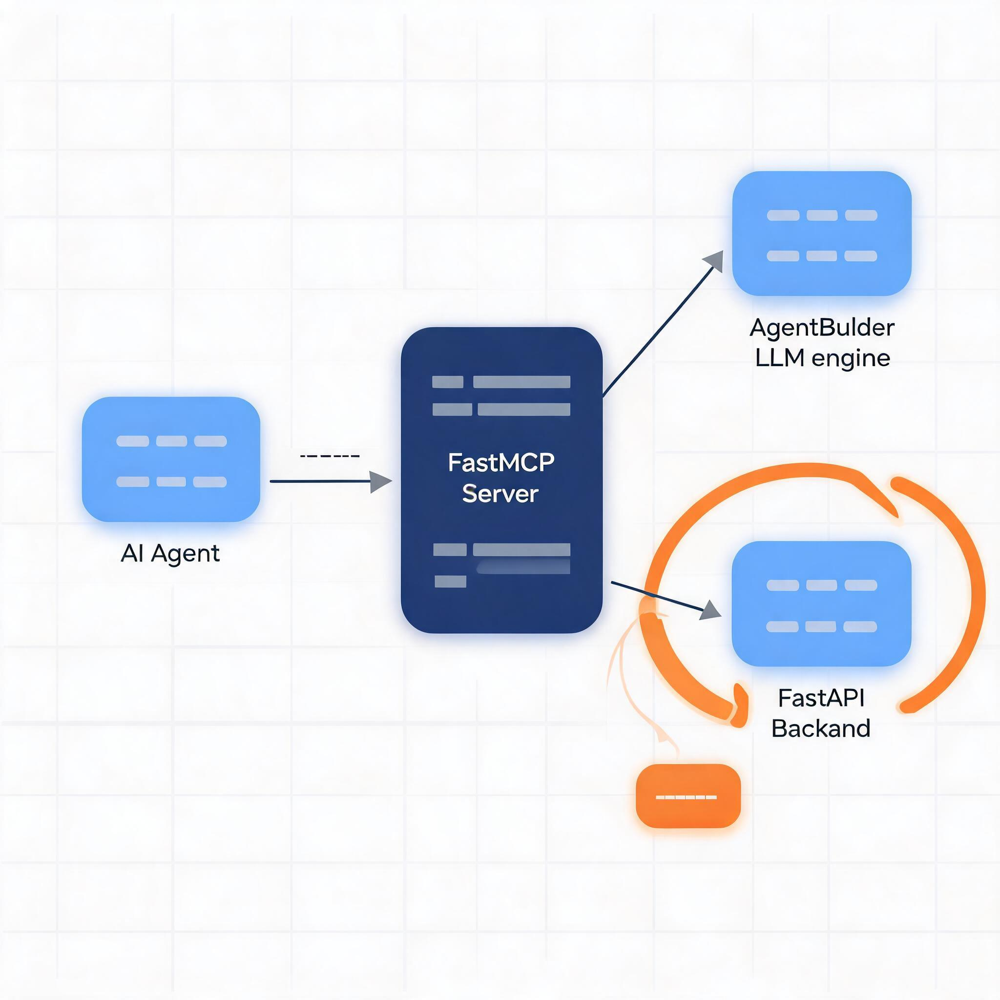
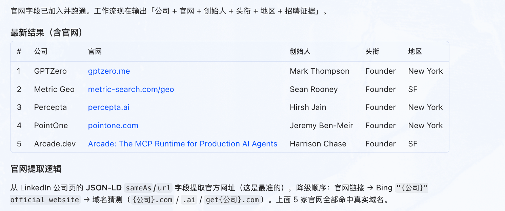

# FlowX | Workflow Compiler for AI Agents


  


FlowX is a local MCP server for creating workflows through conversation, designed to integrate easily with agent systems such as Hermes, WorkBuddy, and TraeWork.

FlowX is released under the Apache License 2.0.

FlowX can be understood in two layers:

- As a workflow compiler for AI agents, it turns natural-language requirements into runnable workflow artifacts.
- As a workflow evolution engine, it lets an agent keep updating node logic, execution paths, and output quality through follow-up prompts.

It also acts as the bridge between agent-side skills and MCP-side execution.

FlowX packages workflow creation, updates, startup, debugging, and execution into one MCP tool surface. You describe the task, and the agent can continuously generate and iterate backend workflows, allowing the system to behave like a workflow evolution engine that keeps moving closer to real business goals.

> Your agent can now build, rerun, and evolve its own workflows.

An [MCP](https://modelcontextprotocol.io) server that exposes the **`meta_agent`** workflow
builder and the **`ag_ui_workflow`** runtime engine as a set of tools, so any MCP client
(Claude Code, Cursor, Codex, VS Code Copilot Chat, ...) can:

1. **create** a new AG-UI workflow from a natural-language requirement,
2. **dynamically update** a workflow's backend artifacts (`workflow.json`, `{node}.py`,
   `main.py`) from a change prompt,
3. **start** the generated FastAPI backend engine for a workflow,
4. **reload** the backend after an update,
5. **inspect** the input format required by every user-input node,
6. **run** a workflow step from a chat message and collect the results.

It follows the same `FastMCP` tool-registration pattern used by the `hermes-agent`
MCP server and is intended for pure local stdio use.

---

## Product Positioning


*FlowX 将自然语言需求编译为可运行、可迭代的工作流产物*

FlowX connects the full local workflow loop inside one MCP surface:

1. Describe the task in natural language.
2. Generate or amend `workflow.json`, node backends, and `main.py`.
3. Start or reload the local FastAPI backend.
4. Run workflow steps from chat, inspect results, and continue the next iteration.

### Where FlowX sits

```text
AI Agent
   |
   +-------------------+
   |                   |
   v                   v
 Skill                MCP
   |                   |
   +---------+---------+
             |
             v
           FlowX
             |
             v
          Workflow
             |
             v
   Code / Tools / APIs
             |
             v
           Runtime
```

FlowX is the convergence layer where reusable agent skills and MCP-exposed tool access are compiled into an explicit workflow that can actually run.

### Transform skill into workflow

```text
Skill
  |
  v
FlowX Compiler
  |
  v
Executable Workflow
```

This is the key conceptual upgrade FlowX provides:

- A skill stays at the level of reusable intent, reasoning pattern, or operating procedure.
- FlowX compiles that skill into workflow structure, node code, tool wiring, and runnable backend behavior.
- The result is an executable workflow that can be started, reloaded, inspected, and evolved inside the same local MCP loop.

| Positioning | What it means |
| --- | --- |
| Conversational workflow generation | Turn a requirement directly into workflow files and executable node code. |
| Compile skills into workflows | Transform a reusable skill into an executable workflow with explicit nodes, code, tools, and runtime steps. |
| Dynamic updates and reloads | Refine a running workflow after each feedback round instead of recreating it from scratch. |
| Native MCP integration | Plug FlowX into local MCP clients so the agent can operate the workflow from the same conversation. |
| Recoverable outputs | Inspect inputs, run steps, and feed returned text, files, or images into the next decision. |

## Architecture



*FlowX 将 MCP 客户端、AgentBuilder 与 FastAPI 工作流后端串成一条本地闭环*

```
MCP client  ──stdio──►  flowx_mcp.server (FastMCP)
                │
                ├── meta_agent.AgentBuilder  ──►  LLM (DeepSeek/...)
                │       (create / update / plan / generate)
                │
                └── subprocess: python main.py  ──►  FastAPI backend
                  │                                  │
                  │   POST /api/run-step (SSE)       │
                  └──────────────────────────────────┘
               ag_ui_workflow.WorkflowEngine
```

The MCP server keeps a per-workflow `WorkflowHandle` (an `AgentBuilder` plus the running
backend process, port and session state). Tools 3–6 talk to the running backend over HTTP
(`urllib`, no extra deps) and parse the AG-UI SSE event stream.

## Provided tools

| Tool | Purpose |
| --- | --- |
| `create_workflow` | Build a workflow from a requirement into `workspace/workflow_name`. |
| `update_workflow_node` | Amend `workflow.json` + `{node}.py` + `main.py` from a change prompt, then invalidate the current runtime session/backend so stale processes cannot keep serving the old graph. |
| `start_backend` | Launch the generated FastAPI backend for a workflow. |
| `reload_workflow` | Restart the backend (picks up updated node files / `workflow.json`). |
| `restart_builder` | Recreate the in-memory `AgentBuilder` for a workflow from disk and optionally restart the backend. |
| `get_node_input_formats` | List every user-input node and the input it expects. |
| `run_workflow_step` | Format a chat message into a step input, run it, return results. |
| `list_workflows` | (helper) List workflows known to the server. |
| `list_workflow_folders` | List workflow folders discovered on disk under the workspace root. |
| `upload_workspace_input_file` | Save a base64-encoded file into `workspace/inputs` and return its path. |
| `list_workflow_python_files` | List all `.py` files under a workflow folder. |
| `get_workflow_json` | Read the root `workflow.json` file for a workflow folder and return it as JSON. |
| `get_workflow_files` | Read specific workflow files by file name or relative path. |
| `get_workflow_binary_files` | Read specific workflow binary files and return base64 content plus MIME type. |
| `replace_workflow_files` | Replace specific workflow files by file name or relative path. |

## Installation

FlowX requires Python 3.10+.

`meta_agent` and `ag-ui-workflow` are installed from Git remotes, not from PyPI.
The default install path below pulls `meta_agent` from GitHub, and `meta_agent`
then resolves its compatible `ag-ui-workflow` dependency from its own pinned
Git reference.

### Git remote install

#### pip

```bash
python3.10 -m venv .venv
source .venv/bin/activate
python -m pip install --upgrade pip
python -m pip install -e '.[git]'
```

#### Poetry

```bash
poetry env use python3.10
poetry install -E git
```

#### uv

```bash
uv sync --extra git
```

#### conda

```bash
conda env create -f environment.yml
conda activate flowx-mcp
```

### Local sibling source install

If `meta_agent` and `ag_ui_workflow` are only available as local checkouts,
install them into the same environment before installing FlowX itself.

#### pip

```bash
python3.10 -m venv .venv
source .venv/bin/activate
python -m pip install --upgrade pip
python -m pip install -e ../ag_ui_worflow --no-deps
python -m pip install -e ../meta_agent --no-deps
python -m pip install -e .
```

#### Poetry

```bash
poetry env use python3.10
poetry install
poetry run pip install -e ../ag_ui_worflow --no-deps
poetry run pip install -e ../meta_agent --no-deps
```

#### uv

```bash
uv venv --python 3.10
uv pip install --python .venv/bin/python -e ../ag_ui_worflow --no-deps
uv pip install --python .venv/bin/python -e ../meta_agent --no-deps
uv pip install --python .venv/bin/python -e .
```

#### conda

```bash
conda env create -f environment.yml
conda activate flowx-mcp
pip uninstall -y meta-agent meta_agent ag-ui-workflow || true
pip install -e ../ag_ui_worflow --no-deps
pip install -e ../meta_agent --no-deps
pip install -e .
```

FlowX also auto-detects sibling folders named `meta_agent`,
`ag_ui_worflow`, and `ag_ui_workflow`. If you do not want editable installs,
set `FLOWX_EXTRA_PATHS` instead.

The Git remote used by the default install path is:

```text
https://github.com/AIpRoBuilder/meta_agent.git
```

## Configuration

```bash
cp .env.example .env
```

Then fill in at least `FLOWX_LLM_PROVIDER`, `FLOWX_LLM_MODEL`,
`FLOWX_LLM_API_KEY`, and `FLOWX_DEFAULT_WORKSPACE`.

FlowX loads configuration from existing process environment variables first, then
from `.env` under `FLOWX_CONFIG_ROOT` when that variable is set, then from `.env`
in the current working directory, and finally from a repo-local `.env` when you
run from a source checkout.

Use `FLOWX_EXTRA_PATHS` to add source roots for `meta_agent` and
`ag_ui_workflow` when those packages are not installed into the current
environment. On macOS and Linux, separate entries with `:`.

## Run

Use the installed `flowx-mcp` console script when possible. If you are working
directly from a repo checkout, `python3.10 run_server.py` still works.

```bash
# default: stdio transport for local MCP hosts
flowx-mcp

# verbose logging
flowx-mcp --verbose

# source-checkout entry point
python3.10 run_server.py

```

If you are using Poetry or uv without activating the environment, prefix the
command with `poetry run` or `uv run`.

Use stdio when the MCP host should launch FlowX itself.

## Local stdio MCP client config (e.g. Claude Desktop / VS Code)

```jsonc
{
  "mcpServers": {
    "flowx": {
      "command": "flowx-mcp",
      "env": {
        "FLOWX_LLM_PROVIDER": "deepseek",
        "FLOWX_LLM_MODEL": "deepseek-chat",
        "FLOWX_LLM_API_KEY": "<your key>",
        "FLOWX_DEFAULT_WORKSPACE": "/Users/user/Desktop/codes/flowx_workspaces"
      }
    }
  }
}
```

If your environment is isolated behind Poetry or uv, set the command to
`poetry` with args `['run', 'flowx-mcp']` or to `uv` with args
`['run', 'flowx-mcp']`.

<details>
<summary><strong>Example workflow prompts</strong> (click to expand)</summary>

The following prompts are ready to paste into an MCP client that is already
connected to your local `flowx` MCP server.

### 1. `stock_pressure`

<details>
<summary>Prompt</summary>

```text
Use flowx to create a workflow named stock_pressure.

Build a workflow based on the following theory. Using the most recent n trading days, specified by the user, estimate the likely future distribution price levels for market makers in a user-specified stock and display them on a chart.

Market Maker Distribution Pressure Peak Forecasting Model

I. Model Goal

Use historical trading data, chip distribution, market-maker cost basis, and historical highs to identify future price regions that may form distribution pressure.

Core assumptions:
1. Market makers accumulate positions at low prices after a sharp decline.
2. The accumulation phase forms the market maker's average cost zone.
3. During subsequent rallies, market makers probe overhead sell pressure.
4. Historical high-volume trading zones and previous highs create dynamic resistance.
5. Distribution pressure points are determined by multiple factors together.

II. Input Data

Daily market data:
Date: date
Open: open price
High: high price
Low: low price
Close: close price
Volume: trading volume

III. Chip Distribution Model

Divide the price range into N price buckets.

For each price interval p:
C(p)=Σ Volume(t)

Where:
C(p) represents the cumulative traded chips in that price region.

Peak trading concentration:
P_peak = argmax C(p)

This represents the price zone with the highest cost concentration in the market.

IV. Estimating the Market-Maker Accumulation Cost

Select the accumulation phase using these conditions:
1. The stock experienced a sharp decline.
2. Trading volume expanded significantly.
3. Price entered a sideways consolidation range.

Average market-maker cost:
C_dealer = Σ(P_t × V_t) / ΣV_t

Where:
P_t: transaction price
V_t: volume

This yields the market maker's primary holding cost.

V. Historical Pressure Peak Calculation

Define the pressure score:
Pressure(p)= w1C(p) + w2High_Test(p) + w3Profit(p) + w4Gain(p)

Where:
1. Trading-density pressure C(p)
Represents the historical trading-chip volume accumulated in that price zone.

2. Historical-high pressure High_Test(p)
Measure:
- Whether historical highs occurred at this level
- Whether rallies failed multiple times near this level
- Whether the region formed a top structure

3. Profitable-position pressure Profit(p)
Calculate:
Profit(p)=ΣC(x), x<p

This indicates how many chips below the current price are already in profit.

The more profitable chips there are,
the greater the potential selling pressure.

4. Market-maker gain pressure Gain(p)
Gain(p)= (p-C_dealer)/C_dealer

This represents the market maker's theoretical return at price p.

VI. Pressure Peak Search Algorithm

Step 1:
Build a price-volume matrix:
price_bins = divide(min_price,max_price,N)

Step 2:
Aggregate:
volume_profile[p]

Step 3:
Compute the pressure score for each price level.

Step 4:
Sort:
The highest-scoring levels are the primary pressure peaks.

Output:
Pressure_1
Pressure_2
Pressure_3

Representing:
Primary pressure zone
Secondary pressure zone
Tertiary pressure zone

VII. Dynamic Probe Validation

Observe the market-maker's probing behavior during an upward move:

Case A:
Price rises while volume declines.
Meaning: overhead resistance is relatively weak.

Case B:
Price rises, volume expands sharply, a long upper shadow appears, and price then falls back.
Meaning: this price region contains substantial sell pressure.

Define:
P_pressure = the current failed test price

VIII. Integrated Distribution Price Model

Final prediction:
P_exit = argmax Pressure(p)

That is:
the price corresponding to the maximum pressure score.

Practical estimate:
P_exit ≈ market-maker cost × (1+r)

And:
it should also be close to a historical trading concentration peak.

Where:
r: target market-maker return.

IX. Python Implementation Outline

Input:
OHLCV DataFrame

Compute:
1. Compute volume distribution
2. Estimate market-maker cost
3. Detect historical highs
4. Compute the proportion of profitable chips
5. Compute pressure scores
6. Output pressure peaks

Pseudocode:
for price in price_bins:
    score = (
        w1 * volume_density(price)
        + w2 * historical_high(price)
        + w3 * profit_ratio(price)
        + w4 * dealer_gain(price)
    )

rank(score)

return top_pressure_prices

X. Final Interpretation

The future price at which market makers may distribute is not simply the historical high.
```

</details>

<p align="center">
  
</p>

### 2. `stock_distribution`

<details>
<summary>Prompt</summary>

```text
Use flowx to create a workflow named stock_distribution.

Build a workflow based on the following theory that estimates large-holder and retail chip distribution across current and historical price levels and visualizes it.

## Role
You are a quantitative researcher responsible for building an implicit large-holder versus retail-holder chip-state model from 1-hour OHLCV data, and for identifying accumulation, distribution, and potential price pressure peaks.

## Important Principles
1. With only price and volume, you cannot directly observe the true holdings of large and small accounts.
2. large_ratio / small_ratio are latent-state estimates of the model, not real account holdings.
3. "Price up = large holders sell to small holders, price down = small holders sell to large holders" is a hypothesis to test, not a fact.
4. All real-time features may use only current and past data; no future leakage is allowed.
5. Output probabilities and confidence levels, and do not present model results as certainty.

## Input
The CSV must contain at least:
datetime, open, high, low, close, volume

## Core State
H_t: estimated large-holder chip ratio
L_t: estimated retail-holder chip ratio
H_t + L_t = 1
D_t = H_t - L_t = 2H_t - 1

R_t = (P_t-P_{t-1})/P_{t-1}
V*_t = V_t / EMA(V_t)

## State Transition
Simplest calibratable model:

ΔH_t = -alpha * tanh(R_t / sigma_R) * V*_t

Constrain H_t ∈ [h_min, h_max].

Interpretation:
- High-volume upward moves push H lower, implying implicit dispersion from large holders to small holders.
- High-volume downward moves push H higher, implying implicit concentration from small holders to large holders.
- Small price moves or normal volume produce smaller state changes.
```

</details>

<p align="center">
  
</p>

### 3. `picture_to_svg`

<details>
<summary>Prompt</summary>

```text
Use flowx to create a workflow named picture_to_svg.

Create a workflow that uploads a WeChat QR code image, automatically removes personal name information, and converts it to SVG format.
```

</details>

<p align="center">
  
</p>

### 4. `policy_scrawler`

<details>
<summary>Prompt</summary>

```text
Use flowx to create a workflow named policy_scrawler.

Requirements:
1. Obtain the institution-name templates you need from the national policy publishing institution directory.
2. Combine province, city, and county names across China to construct concrete search names for policy institutions nationwide.
3. Use Playwright to simulate a browser and search Baidu for the official website names of the target institutions.
4. Build a workflow that crawls the official website URLs of policy institutions nationwide.
```

</details>

<p align="center">
  
</p>

### 5. `start-up-hiring`

<details>
<summary>Prompt</summary>

```text
Use flowx to build a crawler workflow that finds the founders of n AI startups that are currently hiring on LinkedIn.
```

</details>

<p align="center">
  
</p>

</details>

## Contact

If you are interested in using FlowX or co-building it, contact me at [peterxcx@gmail.com](mailto:peterxcx@gmail.com).

WeChat QR code:


