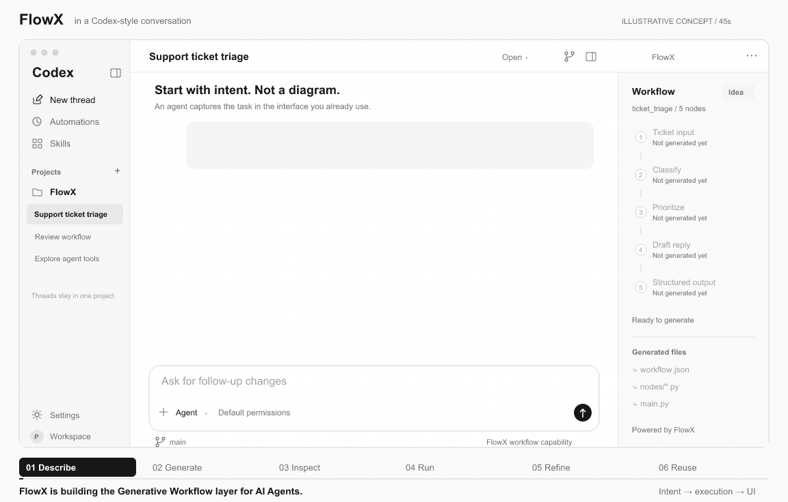
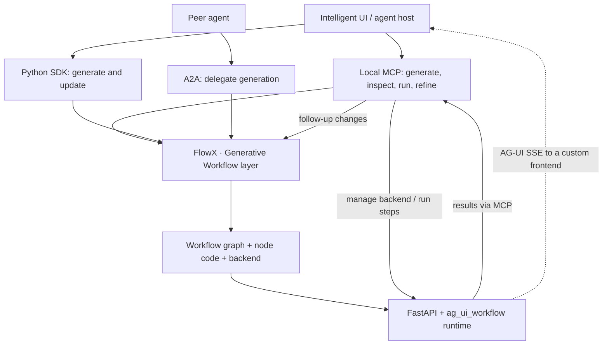
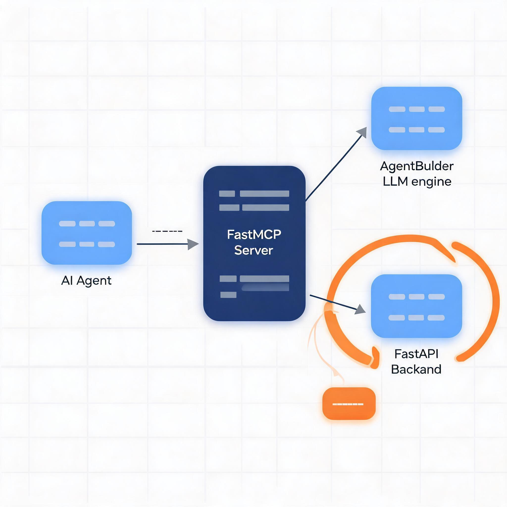
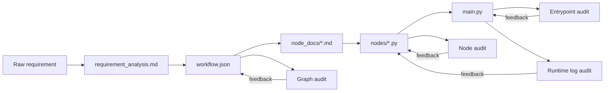
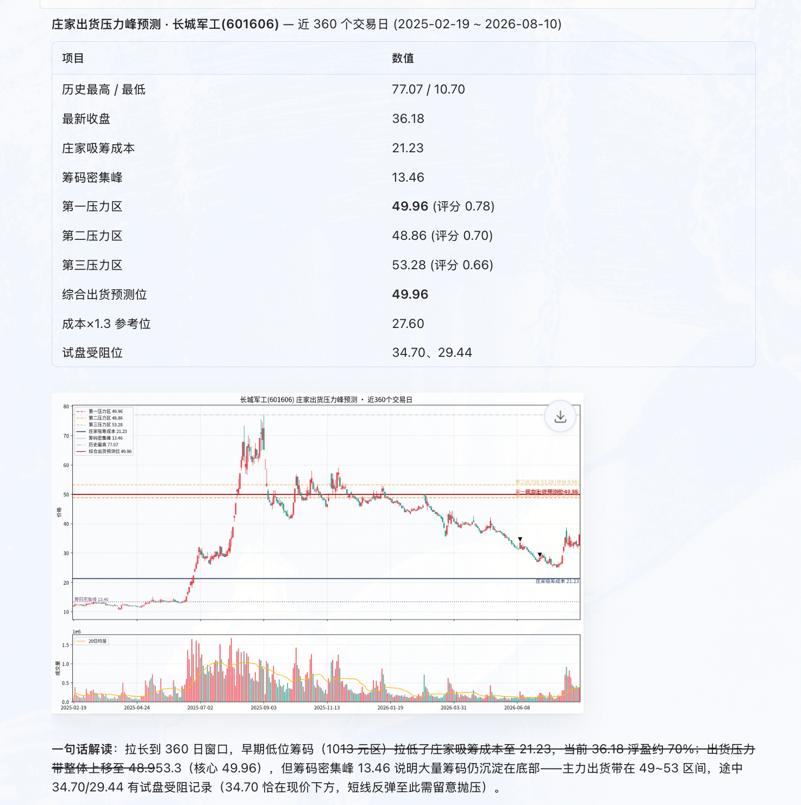
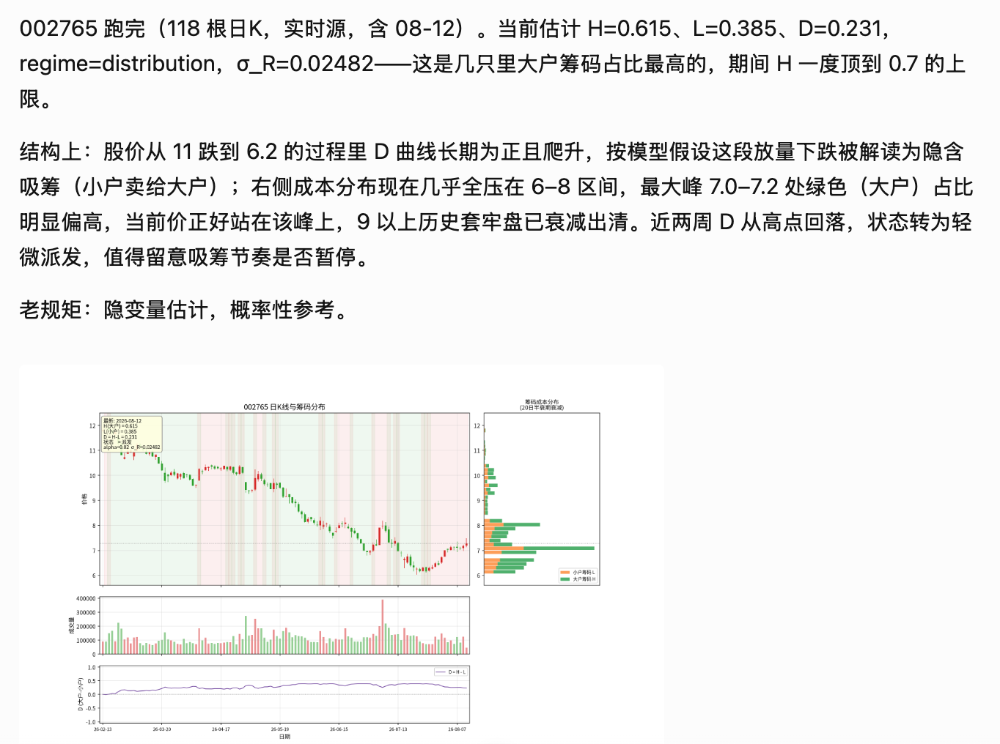
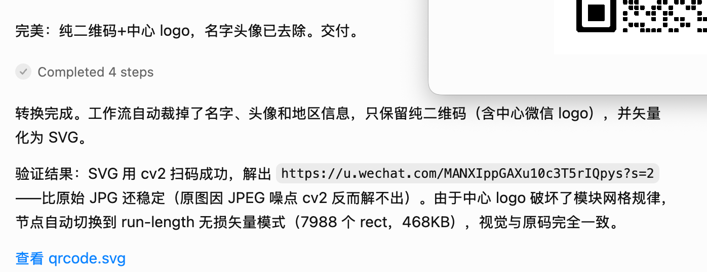
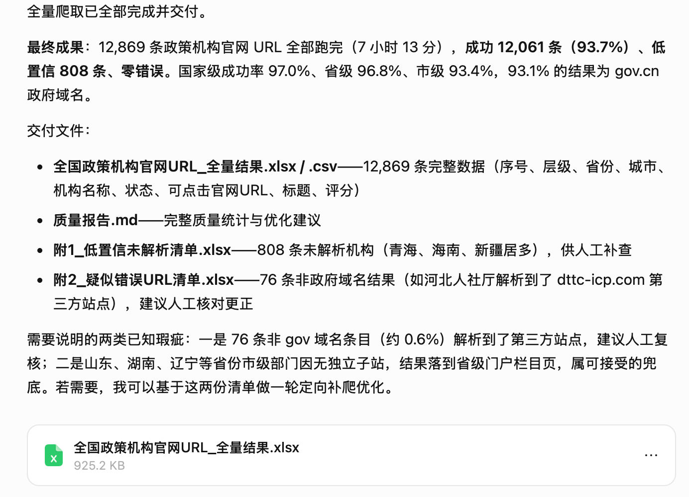
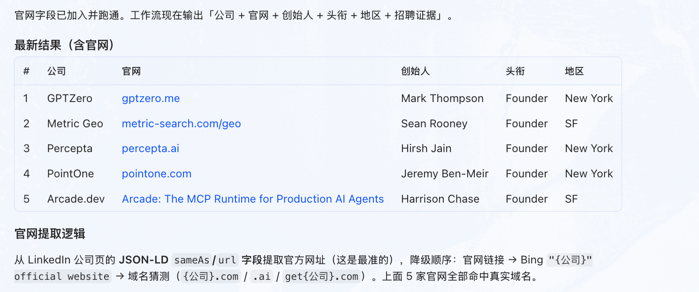

<a name="readme-top"></a>

<div align="center">
  <h1>FlowX</h1>
  <p><strong>FlowX is building the Generative Workflow layer for AI Agents.</strong></p>
  <p>From user intent to executable, inspectable, evolving workflows.</p>
  <p>
    <a href="#see-the-idea-in-45-seconds">See the idea</a> ·
    <a href="#quickstart">Quickstart</a> ·
    <a href="https://modelcontextprotocol.io">Model Context Protocol</a> ·
    <a href="#python-sdk">Python SDK</a> ·
    <a href="#a2a-server">A2A</a> ·
    <a href="https://github.com/AIpRoBuilder/ag_ui_worflow">ag_ui_workflow</a>
  </p>
  <p>
    
    
    
  </p>
</div>

An intelligent UI should do more than display an answer. It should help an agent turn a user's intent into a process that can actually run—and adapt when the intent changes.

FlowX provides that **Generative Workflow layer**: agents generate a workflow graph, node implementations, and a runnable backend from natural language, then inspect, execute, and refine those artifacts through the same conversation. The workflow becomes a reusable process, not just a one-off response or a static plan.

**Describe → Generate → Inspect → Run → Refine → Reuse.**

**Original upstream:** [AIpRoBuilder/FlowX](https://github.com/AIpRoBuilder/FlowX) ·
[Attribution notice](NOTICE) · [Source provenance and verification](docs/PROVENANCE.md).
FlowX remains Apache-2.0 licensed; compliant forks and reuse are welcome.

<p align="center">
  
</p>

*Illustrative walkthrough, not a live recording. Your existing agent remains the assistant; FlowX provides its workflow capability behind the conversation. Messages and per-node cards illustrate what the host UI can render, independent of transport. FlowX does not bundle this interface or automatically generate these card layouts. Generation and execution times are illustrative. See the [storyboard and rendering instructions](assets/README-demo.md).*

## The workflow layer behind intelligent UIs

**Generative UI shapes the interaction. Generative Workflow shapes the execution.** FlowX focuses on the latter: the explicit process an agent can build, run, and change behind a chat, a task panel, or another intelligent interface.

| Layer | Responsibility |
| --- | --- |
| Intelligent UI / agent client | Capture intent and present progress, inputs, and results. The host application owns the interface. |
| **FlowX: Generative Workflow** | Turn intent into workflow artifacts; expose tools to inspect, execute, and refine them. |
| Workflow runtime | Execute generated nodes in a FastAPI backend using [ag_ui_workflow](https://github.com/AIpRoBuilder/ag_ui_worflow); expose step events over AG-UI SSE. |

FlowX is model- and UI-agnostic. Connect an MCP-capable agent client, call the Python SDK, or delegate workflow generation over A2A. A custom frontend can consume the generated backend's events; rendering those events remains the frontend's responsibility. No dedicated integration with a particular model or intelligent UI is implied.

### What ships today

| Capability | What the agent can do |
| --- | --- |
| Intent → executable workflow | Generate a workflow graph, node documentation, Python node code, and a backend entry point. |
| Inspectable artifacts | Read the graph, node inputs, source files, and execution results instead of relying on an opaque plan. |
| Conversational refinement | Apply a follow-up change prompt to existing nodes, then reload the backend to run the updated workflow. |
| A local execution loop | Start, inspect, run, reload, and stop workflow backends through MCP. |
| Reusable workflow files | Keep generated artifacts on disk and discover or reopen workflows for later runs and updates. |

> [!NOTE]
> The primary interactive path is local stdio MCP. The SDK exposes workflow generation and node updates; the A2A adapter currently exposes non-streaming workflow generation. FlowX is a workflow layer, not a hosted UI product.

## Installation

Add the Generative Workflow layer to your agent environment. FlowX requires Python 3.10 or later; one installation includes the shared core, MCP adapter, Python SDK, and A2A adapter.

### Install from Git

#### pip

```bash
# Create and activate a virtual environment
python3.10 -m venv .venv
source .venv/bin/activate

# Install FlowX and its runtime dependencies
python -m pip install --upgrade pip
python -m pip install -e .
```

#### Poetry

```bash
poetry env use python3.10
poetry install
```

#### uv

```bash
uv sync
```

#### conda

```bash
conda env create -f environment.yml
conda activate flowx-mcp
```

### Install with a local AG-UI workflow checkout

The FlowX agent is vendored under `packages/core/flowx_core`. Only [ag_ui_workflow](https://github.com/AIpRoBuilder/ag_ui_worflow) remains an external workflow-runtime dependency. To use a local checkout instead of its Git dependency, install it first and then install FlowX without dependencies.

#### pip

```bash
python3.10 -m venv .venv
source .venv/bin/activate
python -m pip install --upgrade pip
python -m pip install -e ../ag_ui_worflow --no-deps
python -m pip install -e . --no-deps
```

#### Poetry

```bash
poetry env use python3.10
poetry install
poetry run pip install -e ../ag_ui_worflow --no-deps
```

#### uv

```bash
uv venv --python 3.10
uv pip install --python .venv/bin/python -e ../ag_ui_worflow --no-deps
uv pip install --python .venv/bin/python -e . --no-deps
```

#### conda

```bash
conda env create -f environment.yml
conda activate flowx
pip install -e ../ag_ui_worflow --no-deps
pip install -e . --no-deps
```

For source-checkout execution, FlowX automatically discovers each `packages/*` component. Set `FLOWX_EXTRA_PATHS` only when the external `ag_ui_workflow` source is not installed.

## Quickstart

The fastest way to try the describe → generate → run → refine loop is through a local MCP-capable agent client.

### 1. Configure FlowX

```bash
cp .env.example .env
```

Set at least `FLOWX_LLM_PROVIDER`, `FLOWX_LLM_MODEL`, `FLOWX_LLM_API_KEY`, and `FLOWX_DEFAULT_WORKSPACE`.

```dotenv
FLOWX_LLM_PROVIDER=deepseek
FLOWX_LLM_MODEL=deepseek-chat
FLOWX_LLM_API_KEY=
FLOWX_DEFAULT_WORKSPACE=./.flowx_workspaces
```

`FLOWX_CONFIG_ROOT` lets an installed `flowx-mcp` resolve a `.env` file outside the repository checkout. `FLOWX_EXTRA_PATHS` can point at a local [ag_ui_workflow](https://github.com/AIpRoBuilder/ag_ui_worflow) source when it is not installed into the current environment.

### 2. Start the server

```bash
# Default local stdio entry point
flowx-mcp

# Verbose logging
flowx-mcp --verbose

# Source-checkout entry point
python3.10 run_server.py
```

If you are using Poetry or uv without activating the environment, prefix the command with `poetry run` or `uv run`.

### 3. Register FlowX in an MCP client

```jsonc
{
  "mcpServers": {
    "flowx": {
      "command": "flowx-mcp",
      "env": {
        "FLOWX_LLM_PROVIDER": "deepseek",
        "FLOWX_LLM_MODEL": "deepseek-chat",
        "FLOWX_LLM_API_KEY": "<your key>",
        "FLOWX_DEFAULT_WORKSPACE": "/Users/user/Desktop/codes/flowx_workspaces"
      }
    }
  }
}
```

If your environment is isolated behind Poetry or uv, set the command to `poetry` with args `['run', 'flowx-mcp']` or to `uv` with args `['run', 'flowx-mcp']`.

### Python SDK

Embed workflow generation directly in a Python agent or the backend behind your own intelligent UI, without an MCP transport:

```python
from flowx_sdk import FlowXClient

client = FlowXClient(workspace="./workflows")
artifacts = client.create_workflow(
  "ticket_triage",
  "Build a workflow that categorizes and prioritizes support tickets.",
)
print(artifacts.workflow_json_path)
```

### A2A server

Let another agent delegate workflow generation to FlowX through the non-streaming Agent2Agent endpoint:

```bash
flowx-a2a --host 127.0.0.1 --port 8001
```

It serves an A2A agent card at `/.well-known/agent-card.json` and JSON-RPC at `/a2a` (also `/`). Supported methods are `message/send`, `tasks/get`, and `tasks/cancel`. Send an A2A text message with `metadata.workflowName` to compile a workflow; the completed task contains the generated artifact paths.

### 4. Create a workflow from chat

Start with the same support-ticket intent shown in the walkthrough:

```text
Use flowx to create a workflow named ticket_triage.

Build a workflow that accepts a support ticket, classifies its category,
assigns a priority, and drafts a reply. Name the reply node draft_reply.
Return the category, priority, and draft reply as structured output.
```

### 5. Run, refine, and reuse

Follow up in the same conversation:

```text
Inspect ticket_triage's graph and input formats, then start its backend.
Run this ticket through the workflow: "Billing is broken. Our whole team is blocked."

Update the draft_reply node: for urgent tickets, include an escalation note.
Reload the workflow backend and rerun the ticket with a fresh session.
```

The client uses `get_workflow_json` and `get_node_input_formats` to discover the generated graph and inputs, `start_backend` and `run_workflow_step` to execute its steps, and `update_workflow_node` followed by `reload_workflow` to apply a refinement. Exact step IDs and payloads come from the generated workflow—not from a fixed demo schema.

This is the distinction: the agent does not only answer the ticket. It builds and evolves the process for handling the next one.

## Architecture

The Generative Workflow layer has one shared core and three agent-facing interfaces: `flowx_core` plans, generates, and audits artifacts; `flowx_mcp`, `flowx_sdk`, and `flowx_a2a` make those capabilities available to different agent hosts. The generated runtime sits beneath that layer; the intelligent UI sits above it.


```mermaid
flowchart TB
  UI["Intelligent UI / agent host"] --> MCP["Local MCP: generate, inspect, run, refine"]
  UI --> SDK["Python SDK: generate and update"]
  PEER["Peer agent"] --> A2A["A2A: delegate generation"]
  MCP --> CORE["FlowX · Generative Workflow layer"]
  SDK --> CORE
  A2A --> CORE
  CORE --> FILES["Workflow graph + node code + backend"]
  FILES --> RUNTIME["FastAPI + ag_ui_workflow runtime"]
  MCP -->|"manage backend / run steps"| RUNTIME
  RUNTIME -->|"results via MCP"| MCP
  RUNTIME -.->|"AG-UI SSE to a custom frontend"| UI
  MCP -->|"follow-up changes"| CORE
```

### Runtime topology

<div align="center">
  
</div>

- `flowx_mcp.server` exposes the tool surface over stdio through FastMCP.
- `flowx_core.AgentBuilder` creates and updates workflow artifacts from prompts.
- `flowx_sdk.FlowXClient` and `flowx_a2a` call the same agent core without routing through MCP.
- The generated `main.py` runs as a managed FastAPI subprocess per workflow.
- `run_workflow_step` communicates with the backend over HTTP and parses AG-UI SSE events back into MCP responses.

### From intent to workflow artifacts

Workflow compilation is the mechanism behind the Generative Workflow layer. Planning and code generation turn intent into artifacts; audits provide feedback during generation and runtime checks. The artifact flow below is mirrored from [assets/architecture.mmd](assets/architecture.mmd).


```mermaid
flowchart LR
    A[Raw requirement] --> B[requirement_analysis.md]
    B --> C[workflow.json]
    C --> D[node_docs/*.md]
    D --> E[nodes/*.py]
    E --> F[main.py]

    C --> G[Graph audit]
    E --> H[Node audit]
    F --> I[Entrypoint audit]
    F --> J[Runtime log audit]

    G -->|feedback| C
    H -->|feedback| E
    I -->|feedback| F
    J -->|feedback| E
```

## Tool surface

These MCP tools let the host agent operate the workflow layer from the same conversation. UI rendering is deliberately left to the host.

| Category | Tool | Purpose |
| --- | --- | --- |
| Build | `create_workflow` | Build a workflow from a requirement into `workspace/workflow_name`. |
| Build | `update_workflow_node` | Update `workflow.json`, node code, and `main.py` from a change prompt. |
| Build | `restart_builder` | Recreate the in-memory builder state from the workflow on disk. |
| Runtime | `start_backend` | Launch the generated FastAPI backend for a workflow. |
| Runtime | `reload_workflow` | Restart the backend so updated files take effect. |
| Runtime | `kill_workflow` | Stop the running backend for a workflow. |
| Runtime | `run_workflow_step` | Format a chat message into step input, run it, and return results. |
| Inspection | `get_node_input_formats` | List each user-input node and the payload it expects. |
| Inspection | `list_workflows` | List workflows registered in the current FlowX server process. |
| Inspection | `list_workflow_folders` | Discover workflow folders on disk under the workspace root. |
| Inspection | `list_workflow_python_files` | List all Python files inside a workflow folder. |
| Inspection | `get_workflow_json` | Read the root `workflow.json` file for a workflow. |
| Inspection | `get_workflow_files` | Read specific workflow files by file name or relative path. |
| Inspection | `get_workflow_binary_files` | Read binary workflow files and return base64 content with MIME type. |
| Workspace | `upload_workspace_input_file` | Save a base64-encoded file into `workspace/inputs` and return its path. |
| Workspace | `delete_workspace_files` | Delete files from the workspace by file name. |
| Workspace | `replace_workflow_files` | Replace specific workflow files by file name or relative path. |

## Example workflows

Different intents, the same workflow layer: analysis, file transformation, and information collection can each become an executable process. Paste the prompts below into an MCP client connected to your local `flowx` server, then inspect, run, and refine the generated workflow. The screenshots are example outputs, not a bundled FlowX UI; external data sources may require their own access and dependencies.

<details>
<summary><strong>Example workflow prompts</strong></summary>

### 1. `stock_pressure`

<details>
<summary>Prompt</summary>

```text
Use flowx to create a workflow named stock_pressure.

Build a workflow based on the following theory. Using the most recent n trading days, specified by the user, estimate the likely future distribution price levels for market makers in a user-specified stock and display them on a chart.

Market Maker Distribution Pressure Peak Forecasting Model

I. Model Goal

Use historical trading data, chip distribution, market-maker cost basis, and historical highs to identify future price regions that may form distribution pressure.

Core assumptions:
1. Market makers accumulate positions at low prices after a sharp decline.
2. The accumulation phase forms the market maker's average cost zone.
3. During subsequent rallies, market makers probe overhead sell pressure.
4. Historical high-volume trading zones and previous highs create dynamic resistance.
5. Distribution pressure points are determined by multiple factors together.

II. Input Data

Daily market data:
Date: date
Open: open price
High: high price
Low: low price
Close: close price
Volume: trading volume

III. Chip Distribution Model

Divide the price range into N price buckets.

For each price interval p:
C(p)=Σ Volume(t)

Where:
C(p) represents the cumulative traded chips in that price region.

Peak trading concentration:
P_peak = argmax C(p)

This represents the price zone with the highest cost concentration in the market.

IV. Estimating the Market-Maker Accumulation Cost

Select the accumulation phase using these conditions:
1. The stock experienced a sharp decline.
2. Trading volume expanded significantly.
3. Price entered a sideways consolidation range.

Average market-maker cost:
C_dealer = Σ(P_t × V_t) / ΣV_t

Where:
P_t: transaction price
V_t: volume

This yields the market maker's primary holding cost.

V. Historical Pressure Peak Calculation

Define the pressure score:
Pressure(p)= w1C(p) + w2High_Test(p) + w3Profit(p) + w4Gain(p)

Where:
1. Trading-density pressure C(p)
Represents the historical trading-chip volume accumulated in that price zone.

2. Historical-high pressure High_Test(p)
Measure:
- Whether historical highs occurred at this level
- Whether rallies failed multiple times near this level
- Whether the region formed a top structure

3. Profitable-position pressure Profit(p)
Calculate:
Profit(p)=ΣC(x), x<p

This indicates how many chips below the current price are already in profit.

The more profitable chips there are,
the greater the potential selling pressure.

4. Market-maker gain pressure Gain(p)
Gain(p)= (p-C_dealer)/C_dealer

This represents the market maker's theoretical return at price p.

VI. Pressure Peak Search Algorithm

Step 1:
Build a price-volume matrix:
price_bins = divide(min_price,max_price,N)

Step 2:
Aggregate:
volume_profile[p]

Step 3:
Compute the pressure score for each price level.

Step 4:
Sort:
The highest-scoring levels are the primary pressure peaks.

Output:
Pressure_1
Pressure_2
Pressure_3

Representing:
Primary pressure zone
Secondary pressure zone
Tertiary pressure zone

VII. Dynamic Probe Validation

Observe the market-maker's probing behavior during an upward move:

Case A:
Price rises while volume declines.
Meaning: overhead resistance is relatively weak.

Case B:
Price rises, volume expands sharply, a long upper shadow appears, and price then falls back.
Meaning: this price region contains substantial sell pressure.

Define:
P_pressure = the current failed test price

VIII. Integrated Distribution Price Model

Final prediction:
P_exit = argmax Pressure(p)

That is:
the price corresponding to the maximum pressure score.

Practical estimate:
P_exit ≈ market-maker cost × (1+r)

And:
it should also be close to a historical trading concentration peak.

Where:
r: target market-maker return.

IX. Python Implementation Outline

Input:
OHLCV DataFrame

Compute:
1. Compute volume distribution
2. Estimate market-maker cost
3. Detect historical highs
4. Compute the proportion of profitable chips
5. Compute pressure scores
6. Output pressure peaks

Pseudocode:
for price in price_bins:
    score = (
        w1 * volume_density(price)
        + w2 * historical_high(price)
        + w3 * profit_ratio(price)
        + w4 * dealer_gain(price)
    )

rank(score)

return top_pressure_prices

X. Final Interpretation

The future price at which market makers may distribute is not simply the historical high.
```

</details>

<p align="center">
  
</p>

### 2. `stock_distribution`

<details>
<summary>Prompt</summary>

```text
Use flowx to create a workflow named stock_distribution.

Build a workflow based on the following theory that estimates large-holder and retail chip distribution across current and historical price levels and visualizes it.

## Role
You are a quantitative researcher responsible for building an implicit large-holder versus retail-holder chip-state model from 1-hour OHLCV data, and for identifying accumulation, distribution, and potential price pressure peaks.

## Important Principles
1. With only price and volume, you cannot directly observe the true holdings of large and small accounts.
2. large_ratio / small_ratio are latent-state estimates of the model, not real account holdings.
3. "Price up = large holders sell to small holders, price down = small holders sell to large holders" is a hypothesis to test, not a fact.
4. All real-time features may use only current and past data; no future leakage is allowed.
5. Output probabilities and confidence levels, and do not present model results as certainty.

## Input
The CSV must contain at least:
datetime, open, high, low, close, volume

## Core State
H_t: estimated large-holder chip ratio
L_t: estimated retail-holder chip ratio
H_t + L_t = 1
D_t = H_t - L_t = 2H_t - 1

R_t = (P_t-P_{t-1})/P_{t-1}
V*_t = V_t / EMA(V_t)

## State Transition
Simplest calibratable model:

ΔH_t = -alpha * tanh(R_t / sigma_R) * V*_t

Constrain H_t ∈ [h_min, h_max].

Interpretation:
- High-volume upward moves push H lower, implying implicit dispersion from large holders to small holders.
- High-volume downward moves push H higher, implying implicit concentration from small holders to large holders.
- Small price moves or normal volume produce smaller state changes.
```

</details>

<p align="center">
  
</p>

### 3. `picture_to_svg`

<details>
<summary>Prompt</summary>

```text
Use flowx to create a workflow named picture_to_svg.

Create a workflow that uploads a WeChat QR code image, automatically removes personal name information, and converts it to SVG format.
```

</details>

<p align="center">
  
</p>

### 4. `policy_scrawler`

<details>
<summary>Prompt</summary>

```text
Use flowx to create a workflow named policy_scrawler.

Requirements:
1. Obtain the institution-name templates you need from the national policy publishing institution directory.
2. Combine province, city, and county names across China to construct concrete search names for policy institutions nationwide.
3. Use Playwright to simulate a browser and search Baidu for the official website names of the target institutions.
4. Build a workflow that crawls the official website URLs of policy institutions nationwide.
```

</details>

<p align="center">
  
</p>

### 5. `start-up-hiring`

<details>
<summary>Prompt</summary>

```text
Use flowx to build a crawler workflow that finds the founders of n AI startups that are currently hiring on LinkedIn.
```

</details>

<p align="center">
  
</p>

</details>

## Contact

Interested in building the Generative Workflow layer for AI Agents—or connecting it to an intelligent UI? Get in touch at [peterxcx@gmail.com](mailto:peterxcx@gmail.com).

WeChat QR code:


<p align="right">
  <a href="#readme-top">Back to top ↑</a>
</p>